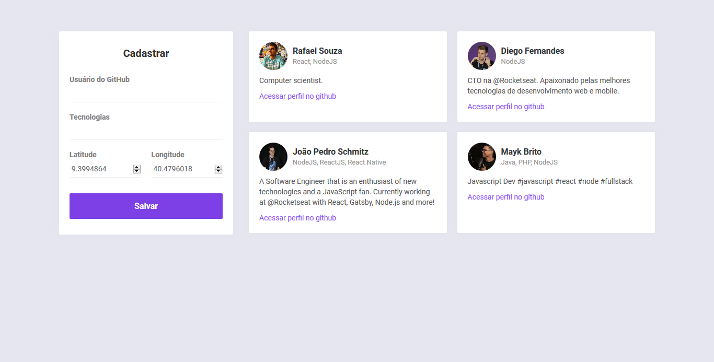
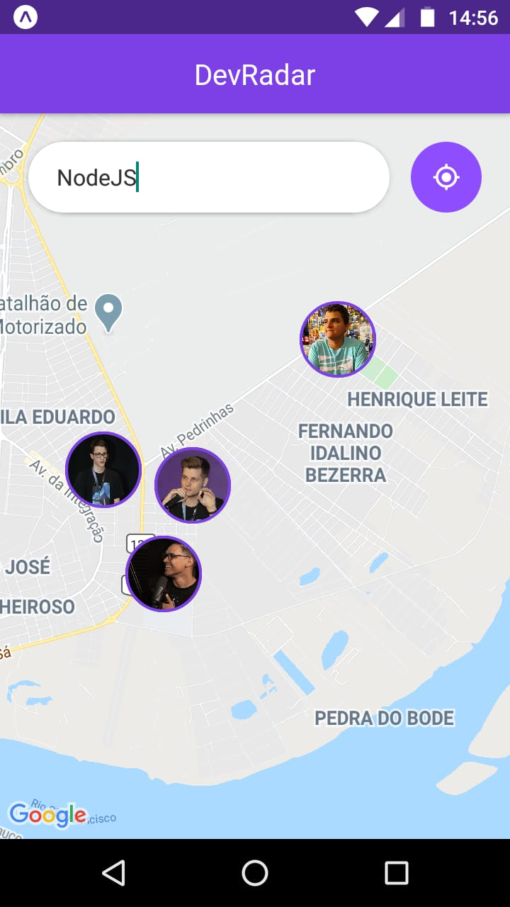

<h1 align="center">
DevRadar
</h1>

<br/>

<h2 align="center">Site</h2>
<h3 align="center">

</h3>
<br/>
<h2 align="center">Aplicativo Mobile</h2>
<h3 align="center">

</h3>
<br/>

<h3 align="center">
Uma aplicação fullstack onde desenvolvedores podem se cadastrar no site e são exibidos no mapa pelo o aplicativo mobile
</h3>

## Instalação
### Backend/API
Clone este repositório e instale as dependências
```sh
git clone https://github.com/rafaelsouz/devradar.git
cd devradar/backend
yarn
# ou
npm install
```
- No arquivo `index` incluir em sua URL de conexão com o banco de dados **MongoDB**
### Rodar Backend/API
```
yarn dev
```
> Lembre-se de deixar rodando o backend...

### Frontend
Instale as dependências dentro da pasta `devradar/frontend`
> Em um novo terminal execute os comandos:
```sh
cd frontend
yarn
# ou
npm install
```
### Rodar Frontend
```
yarn start
```
### App Mobile
O modo mais fácil de rodar esse aplicativo no **Android** é utilizando o [Expo](https://expo.io/).
Primeiro instale o `expo-cli` de forma global em sua máquina. 
Dentro da pasta `devradar/mobile` instale as dependências do app, em seguida execute o app.
```
npm install -g expo-cli
yarn
yarn start
``` 
Ao abrir uma aba em seu navegador do **Expo DevTools** com o **QRCode**, baixe o aplicativo do **Expo** em sua [play store](https://play.google.com/store/apps/details?id=host.exp.exponent) e faça o Scan do QRCode em seu celular.

- No arquivo `service/api` incluir em `LOCALHOST` o URL que aparece pra você no **Expo DevTools** (Em cima do QRCode).

Utilizei as seguintes tecnologias:

-  [Node.js](https://nodejs.org/en/)
-  [Express](https://expressjs.com/)
-  [nodemon](https://nodemon.io/)
-  [mongodb](https://www.mongodb.com/)
-  [axios](https://github.com/axios/axios)
-  [Socket.io](https://www.npmjs.com/package/socket.io)
-  [Cors](https://www.npmjs.com/package/cors)
-  [mongoose](https://www.npmjs.com/package/mongoose)
-  [React](https://pt-br.reactjs.org/)
-  [React Native](https://reactnative.dev/)
-  [Expo](https://expo.io/)
-  [VS Code](https://code.visualstudio.com/)

---

Made with ♥ by Rafael Souza :wave: [linkedin](https://www.linkedin.com/in/rafaelsouz/)